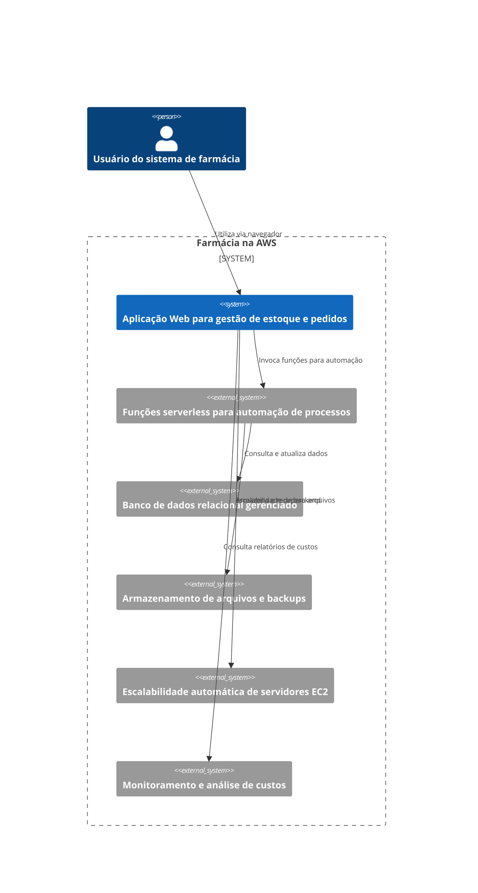
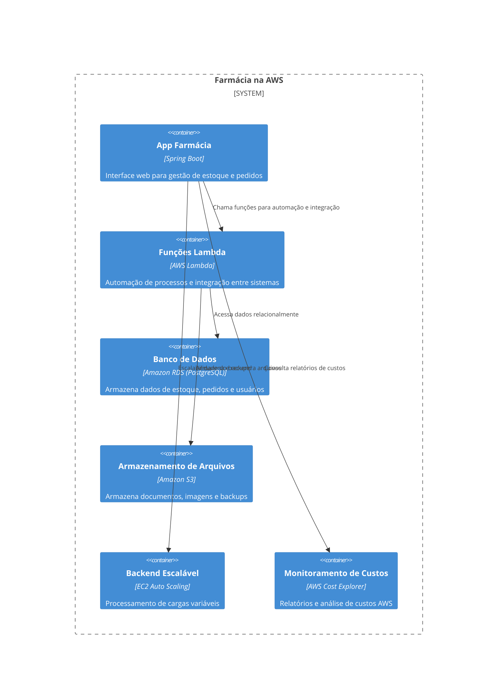
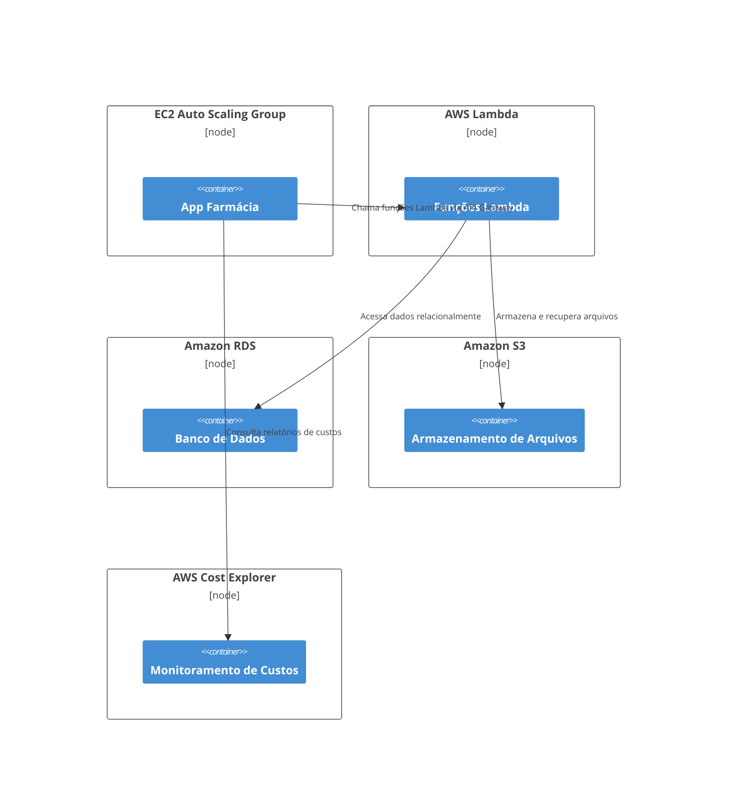

# Documentação Visual: Modelo C4 (Mermaid)

## Contexto

```mermaid
C4Context
Person("Usuário Farmácia", "Usuário do sistema de farmácia")
System_Boundary(s1, "Farmácia na AWS") {
  System("App Farmácia", "Aplicação Web para gestão de estoque e pedidos")
  System_Ext("AWS Lambda", "Funções serverless para automação de processos")
  System_Ext("Amazon RDS", "Banco de dados relacional gerenciado")
  System_Ext("Amazon S3", "Armazenamento de arquivos e backups")
  System_Ext("EC2 Auto Scaling", "Escalabilidade automática de servidores EC2")
  System_Ext("AWS Cost Explorer", "Monitoramento e análise de custos")
}
Rel("Usuário Farmácia", "App Farmácia", "Utiliza via navegador")
Rel("App Farmácia", "AWS Lambda", "Invoca funções para automação")
Rel("AWS Lambda", "Amazon RDS", "Consulta e atualiza dados")
Rel("AWS Lambda", "Amazon S3", "Armazena e recupera arquivos")
Rel("App Farmácia", "EC2 Auto Scaling", "Escalabilidade de backend")
Rel("App Farmácia", "AWS Cost Explorer", "Consulta relatórios de custos")
```

## Containers

```mermaid
C4Container
System_Boundary(s1, "Farmácia na AWS") {
  Container(app, "App Farmácia", "Spring Boot", "Interface web para gestão de estoque e pedidos")
  Container(lambda, "Funções Lambda", "AWS Lambda", "Automação de processos e integração entre sistemas")
  Container(rds, "Banco de Dados", "Amazon RDS (PostgreSQL)", "Armazena dados de estoque, pedidos e usuários")
  Container(s3, "Armazenamento de Arquivos", "Amazon S3", "Armazena documentos, imagens e backups")
  Container(ec2, "Backend Escalável", "EC2 Auto Scaling", "Processamento de cargas variáveis")
  Container(cost, "Monitoramento de Custos", "AWS Cost Explorer", "Relatórios e análise de custos AWS")
}
Rel(app, lambda, "Chama funções para automação e integração")
Rel(lambda, rds, "Acessa dados relacionalmente")
Rel(lambda, s3, "Armazena e recupera arquivos")
Rel(app, ec2, "Escalabilidade do backend")
Rel(app, cost, "Consulta relatórios de custos")
```
## Deploy

```mermaid
C4Deployment
Node(ec2, "EC2 Auto Scaling Group") {
  Container(app, "App Farmácia")
}
Node(lambda, "AWS Lambda") {
  Container(lambda, "Funções Lambda")
}
Node(rds, "Amazon RDS") {
  Container(rds, "Banco de Dados")
}
Node(s3, "Amazon S3") {
  Container(s3, "Armazenamento de Arquivos")
}
Node(cost, "AWS Cost Explorer") {
  Container(cost, "Monitoramento de Custos")
}
Rel(app, lambda, "Chama funções Lambda via API Gateway")
Rel(lambda, rds, "Acessa dados relacionalmente")
Rel(lambda, s3, "Armazena e recupera arquivos")
Rel(app, cost, "Consulta relatórios de custos")
``` 